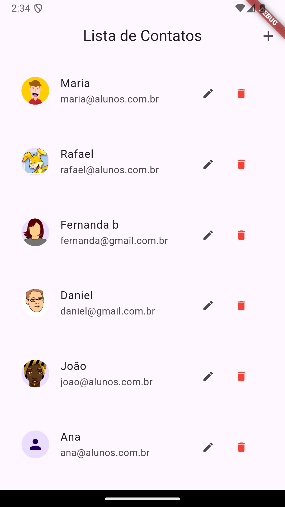

# Lista de Contatos em Flutter

Este projeto é uma aplicação Flutter para gerenciar uma lista de contatos. Ele permite adicionar, editar e remover contatos, com a interface amigável e simples de usar.

## Funcionalidades

- Adicionar novos contatos
- Editar informações de contatos existentes
- Remover contatos da lista

## Captura de Tela



## Tecnologias Utilizadas

- **Flutter**: Framework para o desenvolvimento de aplicações móveis multiplataforma.
- **Provider**: Gerenciamento de estado para fornecer e atualizar dados dos contatos.
- **Dart**: Linguagem de programação utilizada para o desenvolvimento com Flutter.

## Estrutura de Arquivos

- **lib/**
  - **models/user.dart**: Define o modelo de dados `User`, com campos como id, nome, email e url do avatar.
  - **provider/users.dart**: Gerencia a lista de usuários e os métodos para adicionar, editar e remover contatos.
  - **widgets/user_tile.dart**: Widget que renderiza cada contato na lista.
  - **screens/user_list.dart**: Tela principal onde a lista de contatos é exibida.
  
## Como Rodar o Projeto

1. Certifique-se de ter o Flutter instalado. Caso não tenha, siga as [instruções de instalação](https://flutter.dev/docs/get-started/install).
2. Clone este repositório:

   ```bash
   git clone https://github.com/RafaellaBarbosa/contact_list.git
   ```

3. Navegue até o diretório do projeto:

   ```bash
   cd contact_list
   ```

4. Execute o comando abaixo para instalar as dependências:

   ```bash
   flutter pub get
   ```

5. Conecte um dispositivo ou inicie um emulador e execute o aplicativo:

   ```bash
   flutter run
   ```
